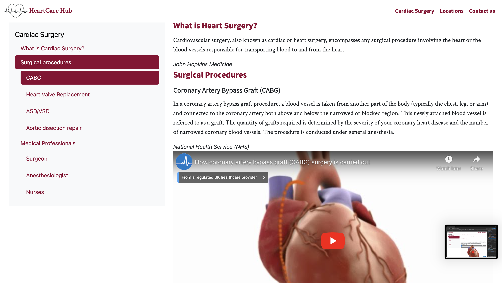

# [HEARTCARE HUB](https://mikavir.github.io/heartcare-hub)

HeartCare Hub is a responsive website that can be viewed and accessed in a wide range of devices. It is aimed towards medical professionals. Under intentions of recruitment, this website will introduce them to the scope of cardiac surgery and the roles and responsibility involved with the practice.

## UX

### Colour Scheme

 Research have shown that most medical websites use blue as the primary theme to promote trust and professionalism[1]. However, I have chosen a set of colours that provide an association to the colours of the heart to correspond with the theme of cardiac surgery. Below are the set of colours chosen to represent the website.

- `#8C0032` used for primary text.
- `#8C0032` used for primary highlights.
- `#3d3035` used for secondary text.
- `#fff` used for secondary highlights.

I used [coolors.co](https://coolors.co/8c0032-e71348-ffffff-666666-333333) to generate my colour palette.

### Typography

Research was completed on the preferred typography on a healthcare website. As HeartCare Hub can be referred to as a healthcare website, using similar typography will respect the convention and encourage consistency.

These three fonts were recommended for the use of healthcare websites: [2]

Source Sans pro- sans-serif font
Crimsons text- serif font

The applied use of a combination serif and sans-serif is further recommended in a medical website to provide contrast.

Therefore, these three recommended fonts will be used along with different font-weights used accodingly. Only two fonts will be used as three or more can make teh website appear excessive and lose professionalism [3].

These fonts will be taken from Google Fonts and to be used within my Cascading Style Sheets(CSS).

Icons from Font-Awesome will be used to provide visualisation amongst the text.

- [Source Sans 3](https://fonts.google.com/specimen/Source+Sans+3?query=source+sans) was used for the primary headers and titles.

- [Crimson Text](https://fonts.google.com/specimen/Crimson+Text) was used for all other secondary text.

- [Font Awesome](https://fontawesome.com) icons were used throughout the site, such as the social media icons in the footer.

## User Stories

### New Site Users

- As a new site user, I would like to gain knowledge of cardiac surgery and what it involves, so that I can gain understanding.
- As a new site user, I would like to know if I am eligible for the role, so that I can consider the job.
- As a new site user, I would like to know where they do cardiac surgery, so that I can consider the location of employment.
- As a new site user, I would like to know the benefits of being a cardiac health professional, so that I can consider it as an employment.

### Returning Site Users

- As a returning site user, I would like to know the locations, so that I can consider the locations for employment.
- As a returning site user, I would like to find contact information, so that I can get in touch for potential employment.
- As a returning site user, I would like to gain resources, so that I can be knowledgeable on the commencement of employment.

### Site administrator 

- As a site administrator, I would like to have a clear logo, so that I can increase my brand recognition.
- As a site administrator, I would like to add my social media links, so that I can improve my online presence.
- As a site administrator, I would like a intriguing prompt, so that I can increase the likelihood of recruitment
- As a site administrator, I would like to create a way to connect, so that I can foster trust and credibility with my target audiences.
## Wireframes

To follow best practice, wireframes were developed for mobile, tablet, and desktop sizes.
I've used [Balsamiq](https://balsamiq.com/wireframes) to design my site wireframes.

### Mobile Wireframes

 Click here to see the Mobile Wireframes 

Home
  - 

Information
  - 

Location
  - 

Contact 
  - 

Details Form
  - 

### Desktop Wireframes

 Click here to see the Desktop Wireframes 

Home
  - 

Information
  - 

Location
  - 

Contact
  - 

Details Form
  - 

## Features

### Existing Features

- **Location Cards**

    - In the index page, I have created cards that enable site users to redirect themselves to their desired area of centers. These cards incorporate an interactive zoom hover effect. This feature allows site users to easily find information about where they can work. The cards redirect them to the location page, which displays hospitals in the desired area.

- **Information page**

    - When a site user clicks on 'Cardiac Surgery' in the navigation bar, they will be redirected to the information page dedicated to cardiac surgery. This page provides comprehensive navigation, offering detailed information about various aspects of cardiac surgery. This feature allows users interested in cardiac surgery to easily access and gain valuable information about the practice. YouTube videos were also implemented to aid visual and audio learners.

- **Call-To-Action**

    - This call-to-action section is located on the index page. It is designed to prompt target audiences to seek more information regarding the practice. The section contains a button with a clear imperative message, 'Find out more.' Additionally, it features an image of a group of smiling healthcare professionals to associate a positive nature with the employment and encourage recruitment.

- **Map to the hospitals and contact information**

    - Information about the centers' locations is available on the dedicated location page. You can find the address, contact details, and a hospital image for easy recognition. Additionally, there's an embedded Google Maps feature to enable users to quickly determine the hospital's proximity. This information is valuable for users considering these hospitals for employment, as they can assess accessibility and convenience.

- **Contact form**

    - A user-friendly contact form that allows users to share their details and express concerns or questions is implemented in the contact page. This not only fosters a sense of trust but also serves as a relationship-building feature. Furthermore, the provided details can be a valuable connection point, enabling us to keep track of users interested in employment opportunities on the site. Upon submission of the form, a confirmation page is displayed to provide feedback on the successful completion of the submission process.

- **Social Media Links**

    - In the footer section, you'll find links to our social media profiles, providing an avenue for enhanced connection with site users and contributing to the establishment of a robust online business presence.

- **Logo**

    - The navigation bar features a distinctive and memorable logo – a heart accompanied by the company name, strategically designed to resonate with cardiac surgery. This logo not only ensures clarity but also promotes brand recognition, fostering a stronger connection with our audience.

### Future Features

- Customer Testimonials
    - Incorporating testimonials and reviews from our users will significantly bolster the website's credibility and trustworthiness. This addition is poised to enhance user engagement, encouraging repeat visits. Furthermore, these testimonials provide a platform for users to articulate the benefits they've experienced, effectively communicating the value of our website.

- About Us page
    - Introducing an about us page will allow site users to learn more about the organisation fostering trust and credibilility.

- Question and Answers
    - The integration of this feature will enhance user experience by streamlining site navigation, ultimately saving users valuable time in accessing the information they seek.

## Tools & Technologies Used
- [HTML](https://en.wikipedia.org/wiki/HTML) used for the main site content.
- [CSS](https://en.wikipedia.org/wiki/CSS) used for the main site design and layout.
- [Git](https://git-scm.com) used for version control. (`git add`, `git commit`, `git push`)
- [GitHub](https://github.com) used for secure online code storage.
- [GitHub Pages](https://pages.github.com) used for hosting the deployed front-end site.
- [Gitpod](https://gitpod.io) used as a cloud-based IDE for development.
- [Bootstrap](https://getbootstrap.com) used as the front-end CSS framework for modern responsiveness and pre-built components.
- [Balsamiq](https://balsamiq.com/wireframes) used to make wireframes.
- [DevTools](https://developer.chrome.com/docs/devtools) used to debug.

## Testing

For all testing, please refer to the [TESTING.md](TESTING.md) file.

## Deployment

The site was deployed to GitHub Pages. The steps to deploy are as follows:

- In the [GitHub repository](https://github.com/mikavir/heartcare-hub), navigate to the Settings tab 
- From the source section drop-down menu, select the **Main** Branch, then click "Save".
- The page will be automatically refreshed with a detailed ribbon display to indicate the successful deployment.

The live link can be found [here](https://mikavir.github.io/heartcare-hub)

### Local Deployment

This project can be cloned or forked in order to make a local copy on your own system.

#### Cloning

You can clone the repository by following these steps:

1. Go to the [GitHub repository](https://github.com/mikavir/heartcare-hub) 
2. Locate the Code button above the list of files and click it 
3. Select if you prefer to clone using HTTPS, SSH, or GitHub CLI and click the copy button to copy the URL to your clipboard
4. Open Git Bash or Terminal
5. Change the current working directory to the one where you want the cloned directory
6. In your IDE Terminal, type the following command to clone my repository:
	- `git clone https://github.com/mikavir/heartcare-hub.git`
7. Press Enter to create your local clone.

Alternatively, if using Gitpod, you can click below to create your own workspace using this repository.

Please note that in order to directly open the project in Gitpod, you need to have the browser extension installed.
A tutorial on how to do that can be found [here](https://www.gitpod.io/docs/configure/user-settings/browser-extension).

#### Forking

By forking the GitHub Repository, we make a copy of the original repository on our GitHub account to view and/or make changes without affecting the original owner's repository.
You can fork this repository by using the following steps:

1. Log in to GitHub and locate the [GitHub Repository](https://github.com/mikavir/heartcare-hub)
2. At the top of the Repository (not top of page) just above the "Settings" Button on the menu, locate the "Fork" Button.
3. Once clicked, you should now have a copy of the original repository in your own GitHub account!

### Local VS Deployment

There are no differences identified between the local and deployment.

## Credits

### Content

| Source | Location | Notes |
| --- | --- | --- |
| [Markdown Builder](https://tim.2bn.dev/markdown-builder) | README and TESTING | tool to help generate the Markdown files |
| [Chris Beams](https://chris.beams.io/posts/git-commit) | Version control | "How to Write a Git Commit Message" |
| [Bootstrap](https://getbootstrap.com/docs/4.0/components/navbar/) | Entire site | Responsive HTML/CSS/navbar |
| [StackOverflow](https://stackoverflow.com/questions/40436285/bootstrap-navbar-logo-size) | Entire site | Customising nav |
| [Bootstrap](https://getbootstrap.com/docs/5.3/components/carousel/) | Index page and Location page | Setting up a carousel |
| [YouTube](https://www.youtube.com/watch?v=drAGqG-jm2Q) | Index page and Location page | Zoom hover effect |
| [YouTube](https://www.youtube.com/watch?v=bGl6Jnud0QA) | Information page | Costumising the colours of the navpills |
| [YouTube](https://www.youtube.com/watch?v=KIC0OK9nKXY) | Location | Embedding maps in HTML |
| [YouTube](https://yoast.com/how-to-make-youtube-videos-responsive/) | Information page | Making the YouTube videos responsive |
| [YouTube](https://www.youtube.com/watch?v=u51Zjlnui4Y) | PP3 terminal | tutorial for adding color to the Python terminal |
| [NHS](https://www.nhs.uk/conditions/congenital-heart-disease/types/#:~:text=Septal%20defects,main%20chambers%20of%20the%20heart.)| Information page | Information regarding Septal Defects|
| [NHS](https://www.nhs.uk/conditions/coronary-artery-bypass-graft-cabg/)| Information page | Information regarding Coronary Artery Bypass Graft|
| [Hopkins Medicine](https://www.hopkinsmedicine.org/health/treatment-tests-and-therapies/cardiovascular-surgery.) | Information page | Information regarding cardiac surgery |
| [NHS Scotland](https://apply.jobs.scot.nhs.uk/Job/JobDetail?JobId=133087#:~:text=Duties%20include%20the%20provision%20of,bedded%20cardiothoracic%20critical%20care%20unit) | Information page | Information regarding aneasthethist role |
| [Indeed Career](https://au.indeed.com/career-advice/finding-a-job/what-does-a-cardiac-nurse-do) | Information page | Information regarding nurses |
| [StackOverflow](https://stackoverflow.com/questions/8097744/how-do-i-center-this-form-in-css) | entire site | How to center a div in a div |
| [YouTube](https://www.youtube.com/watch?v=-jnCgrR_yKg) | Entire Site | Tutorial on the bootstrap grid system |

### Media
| Source | Location | Type | Notes |
| --- | --- | --- | --- |
| [Freepik](https://www.freepik.com/free-vector/two-heartbeat-ecg-line-heart-outlines_37682371.htm#page=3&query=ecg%20machine&position=2&from_view=keyword&track=ais&uuid=425c2731-6457-4514-8172-7f8436c45076) | Entire Website | Image | Logo |
| [Oracle Cerner](https://www.cerner.com/ie/en/client-achievements/digital-ecgs-speeding-up-cardiac-care-decisions) | Index page | Image | Hero Background |
| [Terry Berry](https://www.terryberry.com/blog/employee-recognition-ideas-for-healthcare-industry/) | Index page | Image | Hero background |
| [Visit Wales](https://www.visitwales.com/destinations/south-wales/cardiff/top-things-see-and-do-cardiff-bay) | Index page and Location page | Image | Image of Cardiff in locations |
| [Visit Wales](https://www.visitwales.com/destinations/west-wales/swansea-bay/things-see-and-do-swansea) | Index page and Location page | Image | Image of Swansea in the Locations |
| [Telegraph](https://www.telegraph.co.uk/travel/destinations/europe/united-kingdom/england/bristol/articles/bristol-travel-guide/) | Index page and location page | Image | Image of Bristol in the locations |
| [British Heart Foundation](https://www.bhf.org.uk/what-we-do/our-research/research-successes/beating-heart-surgery) | Information page | Image | Hero Background on Information page |
| [Canadian Business College](https://canadianbusinesscollege.com/2021/03/12/5-qualities-shared-by-professionals-in-healthcare-careers/) | Index page | Image | Image for recruitment container |
| [Wikipedia](https://en.wikipedia.org/wiki/University_Hospital_of_Wales) | Locations and Contact page| Image | Image for University Hospital of Wales |
| [Wikipedia](https://en.wikipedia.org/wiki/Bristol_Royal_Infirmary) | Locations and Contact page | Image | Image for Bristol Royal Infirmary|
| [NHS Wales](https://sbuhb.nhs.wales/hospitals/our-hospitals/morriston-hospital/) | Locations and Contact page| Image | Image for Morriston Hospital|
| [Google Maps](https://www.google.com/maps/) | Location page | Embedded map | Maps for the hospitals|
| [The Tech Blog](https://thetechblog.net/tips-to-grow-your-healthcare-business-by-sourceims-a-healthcare-call-center-company/) | Contact page | Image | Hero Background image for Contact page|
| [Bupa Health UK](https://www.youtube.com/watch?v=vw6OKJu07NE) | Information page | Youtube Video | Informative video on Coronary Artery Bypass Graft|
| [Osmosis from Elsevier](https://www.youtube.com/watch?v=e7ObXrdtXek) | Information page | Youtube Video | Informative video on ventricular septal defect|
 [Osmosis from Elsevier](https://www.youtube.com/watch?v=GUagU8YrJZc) | Information page | Youtube Video | Informative video on aortic dissection|

Reference:
[1]doctorlogic.com. (n.d.). Beyond Blue and White: A Guide to Choosing Medical Logo Colors. [online] Available at: https://doctorlogic.com/blog/medical-logo-colors.html#:~:text=Why%20Are%20Blue%20And%20White.
[2]Anon, (n.d.). Choosing The Best Fonts For Dental And Medical Websites | Dental CountryTM. [online] Available at: https://dentalcountry.com/doctors/articles/choosing-the-best-fonts-for-dental-and-medical-websites/#whatis [Accessed 10 Dec. 2023].
[3]ThoughtCo. (n.d.). Everything You Need to Know About Choosing the Right Font Family. [online] Available at: https://www.thoughtco.com/font-families-basics-3467382.

### Acknowledgements

- I would like to thank my Code Institute mentor, [Tim Nelson](https://github.com/TravelTimN) for their support throughout the development of this project.
- I would like to thank the [Code Institute](https://codeinstitute.net) tutor team for their assistance with troubleshooting and debugging some project issues.
- I would like to thank the [Code Institute Slack community](https://code-institute-room.slack.com) for the moral support; it kept me going during periods of self doubt and imposter syndrome.
- I would like to thank my partner Jon and my brother Elan, for believing in me, and allowing me to make this transition into software development.
- I would like to thank my employer, for supporting me in my career development change towards becoming a software developer.
