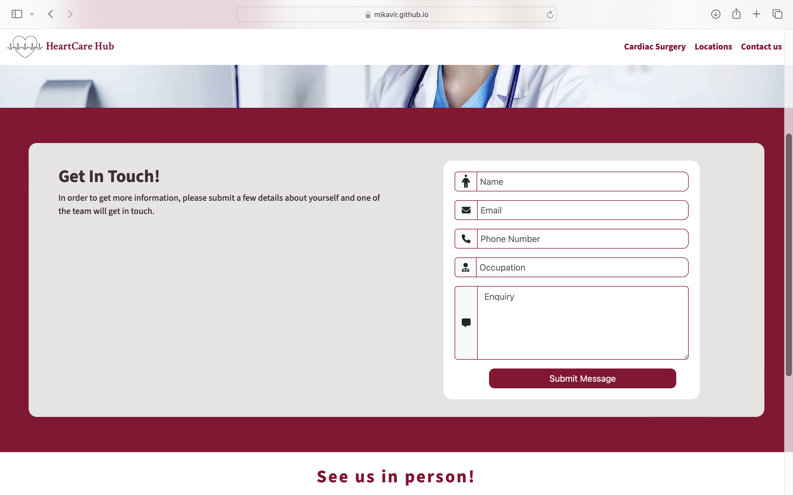

# Testing

Return back to the [README.md](README.md) file.

## Code Validation

### HTML

I have used the recommended [HTML W3C Validator](https://validator.w3.org) to validate all of my HTML files.

| Page | W3C URL | Screenshot | Notes |
| --- | --- | --- | --- |
| Index | [W3C](https://validator.w3.org/nu/?doc=https%3A%2F%2Fmikavir.github.io%2Fheartcare-hub%2Findex.html) |  | Pass: no errors |
| Information | [W3C](https://validator.w3.org/nu/?doc=https%3A%2F%2Fmikavir.github.io%2Fheartcare-hub%2Finformation.html) |  | Pass: no errors |
| Location | [W3C](https://validator.w3.org/nu/?doc=https%3A%2F%2Fmikavir.github.io%2Fheartcare-hub%2Flocation.html) |  | Pass: No Errors |
| Contact | [W3C](https://validator.w3.org/nu/?doc=https%3A%2F%2Fmikavir.github.io%2Fheartcare-hub%2Fcontact.html) |  | Pass: No Errors |
| Confirmation page |[W3C](https://validator.w3.org/nu/?doc=https%3A%2F%2Fmikavir.github.io%2Fheartcare-hub%2Fconfirmation-page.html) |  

### CSS

I have used the recommended [CSS Jigsaw Validator](https://jigsaw.w3.org/css-validator) to validate all of my CSS files.

| File | Jigsaw URL | Screenshot | Notes |
| --- | --- | --- | --- |
| style.css | [Jigsaw](https://jigsaw.w3.org/css-validator/validator?uri=https%3A%2F%2Fmikavir.github.io%2Fheartcare-hub) |  | Only warnings on external library bootstrap show |

## Browser Compatibility

I've tested my deployed project on multiple browsers to check for compatibility issues.

| Browser | Home | Information | Location | Contact | Confirmation | Notes |
| --- | --- | --- | --- | --- | --- | --- |
| Chrome |  |   |   |   | |Works as expected |
| Firefox |   |  |   |    | | Works as expected |
| Safari |  |   |   |   | | Works as expected|

## Responsiveness

I've tested my deployed project on multiple devices to check for responsiveness issues.

| Device | Index | Information | Location | Contact | Confirmation | Notes |
| --- | ---- | ---- | ---- | ---- | ---- | ---- |
| Mobile (DevTools) Iphone XR |  |   |   |  | | Works as expected |
| Tablet (DevTools) Ipad Air |  |   |   |  |  | Works as expected |
| Desktop |  |  |    |    |  | Works as expected |
| Own Device (Iphone 13 pro) |  |   |    |     |   | Works as expected |

## Lighthouse Audit

I've tested my deployed project using the Lighthouse Audit tool to check for any major issues.

| Page | Mobile | Desktop | Notes |
| --- | --- | --- | --- |
| Home |  |  | Performance score affected due to slow response time due to large image and use of external libary in mobile device |
| Information |  |  |Performance score affected due to slow response time due to large image and use of external libary in mobile device|
| Location |  |  | Performance score affected due to slow response time due to large image and use of external libary in mobile device |
| Contact |   |  | Performance score affected due to slow response time due to large image and use of external libary in mobile device |
| Confirmation |   |  | Performance score affected due to slow response time due to large image and use of external libary in mobile device |
## User Story Testing

| User Story | Screenshot |
| --- | --- |
| - As a returning site user, I would like to gain knowledge of cardiac surgery and what it involves, so that I can gain understanding. |  |
| As a new site user, I would like to know if I am eligible for the role, so that I can consider the job. |  |
| As a new site user, I would like to know the benefits of being a cardiac health professional, so that I can consider it as an employment. |  |
|- As a new site user, I would like to know where they do cardiac surgery, so that I can consider the location of employment. |  |
| As a returning site user, I would like to know the locations, so that I can consider the locations for employment.|  |
| As a returning site user, I would like to find contact information, so that I can get in touch for potential employment. |  |
| As a returning site user, I would like to gain resources, so that I can be knowledgeable on the commencement of employment. |  |
| As a site administrator, I would like to have a clear logo, so that I can increase my brand recognition. |  |
| As a site administrator, I would like to add my social media links, so that I can improve my online presence. |  |
| As a site administrator, I would like a intriguing prompt, so that I can increase the likelihood of recruitment|  |
| As a site administrator, I would like to create a way to connect, so that I can foster trust and credibility with my target audiences. | |

## Form Testing

I have succesfuly tested the form in the contact page by submitting it via "post" using the [Code Institute Form Dump](https://formdump.codeinstitute.net/). This has now been changed to redirect to confirmation-page.html via "get" for a better user experience and feedback. This will be changed in the future, once I have the required backend to store the data. 

- 

## Bugs

- Font not all aligned in contact.html in the tablet version.

    

    - To fix this, I increased the font size of the doctor icon to large in my contact.html.

- White space on the sides.

    

    - To fix this, I have set div col under the div rows as the main was a container fluid and set padding to zero.

- When information nav is clicked, the heading in the information page is obscured. 

    

    -To fix this, I have added scroll margin top to the class that targets that heading elememts ie. ".data-comtainer h4, h5".

- When the location card is clicked and directed to the anchor points, the location heading is obscured by the fixed header.

    

    - ~~ Attempted fix: I have added and set scroll-margin-top to the size of my fixed navigation bar of 5em in the #location-information, but the css element is not showing. I have tried to find resources online and there was no solution found. ~~ 
    - To fix this, I have added the id name of the individual locations.

## Unfixed Bugs

There are no unfixed bugs that I am aware of.

